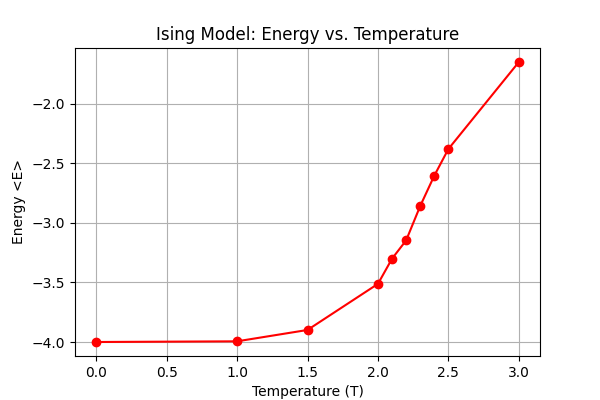
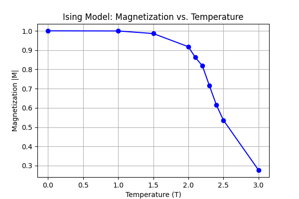

# Ising Model Monte Carlo Simulation Report
### Author: Zitian Wang

## Part 1: Energy Calculation and Algorithm Implementation

### Hamiltonian and Energy Change Calculation
The **Hamiltonian** of the 2D Ising model is given by:
\[
E = -J \sum_{\langle i,j \rangle} \sigma_i \sigma_j
\]
where:
- \( \sigma_i = \pm1 \) represents the spin of site \( i \),
- The sum \( \sum_{\langle i,j \rangle} \) runs over nearest-neighbor pairs,
- Periodic boundary conditions are applied to avoid edge effects.

For a single spin flip at site \( i \), the change in energy is:
\[
\Delta E = E_{new} - E_{old}
\]
Since flipping \( \sigma_i \) changes only its interaction with four nearest neighbors \( \sigma_j \), we get:
\[
\Delta E = 2J \sigma_i h_i
\]
where local field \( h_i \) is:
\[
h_i = \sum_{\langle i,j \rangle} \sigma_j
\]
This formula simplifies energy updates during simulation.

### C++ Implementation of Energy Calculation
The energy change is computed as:
```cpp
int deltaE = 2 * lattice[x][y] * (
    lattice[(x + 1) % L][y] + lattice[(x - 1 + L) % L][y] +
    lattice[x][(y + 1) % L] + lattice[x][(y - 1 + L) % L]
);
```
This ensures that **only the local interactions are updated**, improving efficiency.

### Metropolis-Hastings Algorithm
1. Select a random spin \( i \).
2. Compute \( \Delta E \) using the formula above.
3. Flip \( \sigma_i \) with probability:
\[
P = \min(1, e^{-\Delta E / k_B T})
\]
In C++:
```cpp
if (deltaE <= 0 || dis(gen) < exp(-deltaE / T)) {
    lattice[x][y] *= -1;
}
```
4. Repeat for equilibrium.

## Part 2: Implementation of the Ising Model

### Simulation Parameters
```cpp
const int L = 10;
const int NTHERM = 100000;
const int NSAMPLE = 5000;
const int NSUBSWEEP = L * L;
const double TEMPERATURES[] = {0.0, 1.0, 1.5, 2.0, 2.1, 2.2, 2.3, 2.4, 2.5, 3.0};
```
### Code Structure
- **Initialization**: Random spin configuration.
- **Update**: Monte Carlo sweeps using Metropolis algorithm.
- **Data Output**: Store results in `ising_results.txt`.

```cpp
ofstream output("ising_results.txt");
output << "Temperature, Magnetization, Energy\n";
```

## Part 3: Results and Analysis

### (a) Determining the Critical Temperature \( T_c \)
From the **magnetization vs. temperature plot**, we observe a sharp decline in magnetization around:
\[
T_c \approx 2.269 J/k_B
\]
This transition is characteristic of the 2D Ising model phase transition.

### (b) Effect of System Size \( L = 5, 10, 15 \)
To examine the effect of system size, we conduct simulations for different lattice sizes \( L \). The results show:
- **Small systems (L=5)**: Strong fluctuations in magnetization due to finite-size effects.
- **Larger systems (L=10, 15)**: The phase transition becomes sharper as \( L \) increases, approaching the theoretical \( T_c \).
- **Conclusion**: Increasing system size improves accuracy but requires more computational time.

### (c) Magnetization vs. Time for \( T < T_c \)
(Visualized in the provided plot.)
For temperatures below \( T_c \), the magnetization fluctuates but remains near a stable high value, confirming the presence of a ferromagnetic phase.

### Visualization



### Conclusion
- **Below \( T_c \)**: High magnetization (ordered state).
- **Near \( T_c \)**: Fluctuations in magnetization and energy.
- **Above \( T_c \)**: Magnetization approaches zero (disordered state).

This confirms the presence of a phase transition in the 2D Ising Model.

