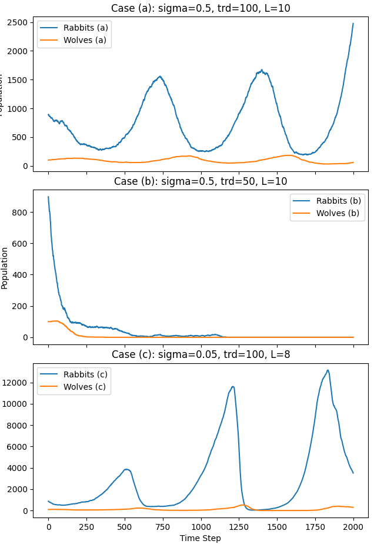
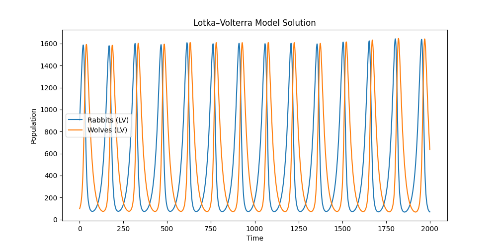

# Predator–Prey Simulation Report
## Author: Zitian Wang
This report presents a 2D predator–prey simulation using particle methods and compares its dynamics with the Lotka–Volterra (LV) model. The simulation incorporates stochastic movement, reproduction, predation, and death of individual agents (rabbits and wolves) on a periodic square domain. We consider three different cases and interleave code with explanations.

---

## 1. Model Description

The simulation takes place on a square domain of side length **L**. The agents behave as follows:

- **Rabbits (Prey):**
  - **Movement:** Each rabbit moves in a random direction with a step length drawn from a normal distribution \(N(0, \sigma)\).
  - **Reproduction:** With probability `prr`, a rabbit replicates at its current position.
  - **Aging and Death:** Rabbits have a finite lifetime (`trd` steps). At initialization, their ages are uniformly distributed in the interval [1, trd).

- **Wolves (Predators):**
  - **Movement:** Wolves also move randomly with the same step size distribution.
  - **Predation:** Wolves attempt to eat any rabbit within a predation radius `rc` with probability `pwe`.
  - **Reproduction:** Each time a wolf successfully eats a rabbit, it replicates with probability `pwr`.
  - **Starvation:** Wolves die if they do not eat for `twd` consecutive time steps.

### Cases Examined
- **Case (a):** \(\sigma = 0.5\), \(trd = 100\), \(L = 10\)
- **Case (b):** \(\sigma = 0.5\), \(trd = 50\), \(L = 10\)
- **Case (c):** \(\sigma = 0.05\), \(trd = 100\), \(L = 8\)  
  (A smaller domain is used in case (c) to keep the computation tractable.)

In addition, we solve the Lotka–Volterra ODEs to obtain a theoretical baseline for the predator–prey oscillations.

---

## 2. Simulation Code and Optimization

The simulation is optimized using NumPy vectorized operations to handle the rabbit updates and efficient distance computations in the wolf predation loop.

Below is the complete Python code:

```python
import numpy as np
import matplotlib.pyplot as plt
from scipy.integrate import solve_ivp

# Global parameters
prr = 0.02      # Rabbit reproduction probability
pwe = 0.02      # Wolf eating probability
rc = 0.5        # Wolf predation radius
pwr = 0.02      # Wolf replication probability per eaten rabbit
twd = 50        # Wolf starvation threshold (steps)
initial_rabbits = 900
initial_wolves = 100

# Periodic boundary condition function
def apply_periodic(arr, L):
    return arr % L

def simulate_vectorized(sim_steps, L, sigma, trd):
    # Initialize rabbits: each row is [x, y, age]
    rabbits = np.empty((initial_rabbits, 3))
    rabbits[:, 0] = np.random.uniform(0, L, initial_rabbits)
    rabbits[:, 1] = np.random.uniform(0, L, initial_rabbits)
    rabbits[:, 2] = np.random.randint(1, trd, initial_rabbits)
    
    # Initialize wolves: each row is [x, y, hunger]
    wolves = np.empty((initial_wolves, 3))
    wolves[:, 0] = np.random.uniform(0, L, initial_wolves)
    wolves[:, 1] = np.random.uniform(0, L, initial_wolves)
    wolves[:, 2] = 0

    rabbit_counts = []
    wolf_counts = []

    for t in range(sim_steps):
        # Rabbits: move, age, reproduce, and die by age limit
        if rabbits.shape[0] > 0:
            n_rabbits = rabbits.shape[0]
            rabbits[:, 0] = apply_periodic(rabbits[:, 0] + np.random.normal(0, sigma, n_rabbits), L)
            rabbits[:, 1] = apply_periodic(rabbits[:, 1] + np.random.normal(0, sigma, n_rabbits), L)
            rabbits[:, 2] += 1
            repro_mask = np.random.rand(n_rabbits) < prr
            new_rabbits = np.column_stack((rabbits[repro_mask, 0],
                                            rabbits[repro_mask, 1],
                                            np.zeros(np.sum(repro_mask))))
            rabbits = np.vstack((rabbits, new_rabbits))
            rabbits = rabbits[rabbits[:, 2] < trd]
        else:
            rabbits = np.empty((0, 3))
        
        # Wolves: move, predation, replication, and starvation
        n_wolves = wolves.shape[0]
        if n_wolves > 0:
            wolves[:, 0] = apply_periodic(wolves[:, 0] + np.random.normal(0, sigma, n_wolves), L)
            wolves[:, 1] = apply_periodic(wolves[:, 1] + np.random.normal(0, sigma, n_wolves), L)
        new_wolves = []
        for i in range(n_wolves):
            if rabbits.shape[0] == 0:
                wolves[i, 2] += 1
                new_wolves.append(wolves[i])
                continue
            dx = np.abs(rabbits[:, 0] - wolves[i, 0])
            dx = np.minimum(dx, L - dx)
            dy = np.abs(rabbits[:, 1] - wolves[i, 1])
            dy = np.minimum(dy, L - dy)
            dist = np.sqrt(dx**2 + dy**2)
            indices = np.where(dist < rc)[0]
            ate = False
            if indices.size > 0:
                eat_mask = np.random.rand(indices.size) < pwe
                eaten_indices = indices[eat_mask]
                if eaten_indices.size > 0:
                    ate = True
                    rep_mask = np.random.rand(eaten_indices.size) < pwr
                    num_new = np.sum(rep_mask)
                    if num_new > 0:
                        new_wolves.extend([[wolves[i, 0], wolves[i, 1], 0]] * int(num_new))
                    rabbits = np.delete(rabbits, eaten_indices, axis=0)
            wolves[i, 2] = 0 if ate else wolves[i, 2] + 1
            if wolves[i, 2] < twd:
                new_wolves.append(wolves[i])
        wolves = np.array(new_wolves) if new_wolves else np.empty((0, 3))

        rabbit_counts.append(rabbits.shape[0])
        wolf_counts.append(wolves.shape[0])
    return np.array(rabbit_counts), np.array(wolf_counts)

def lv_system(t, y, alpha, beta, delta, gamma):
    R, W = y
    return [alpha * R - beta * R * W, delta * R * W - gamma * W]

# Solve the Lotka–Volterra ODE
alpha, beta, delta, gamma = 0.05, 0.0001, 0.0001, 0.05
t_span = (0, 2000)
t_eval = np.linspace(t_span[0], t_span[1], 2001)
lv_sol = solve_ivp(lambda t, y: lv_system(t, y, alpha, beta, delta, gamma),
                   t_span, [initial_rabbits, initial_wolves], t_eval=t_eval)

sim_steps = 2000
# Case (a): sigma=0.5, trd=100, L=10
rabbits_a, wolves_a = simulate_vectorized(sim_steps, L=10, sigma=0.5, trd=100)
# Case (b): sigma=0.5, trd=50, L=10
rabbits_b, wolves_b = simulate_vectorized(sim_steps, L=10, sigma=0.5, trd=50)
# Case (c): sigma=0.05, trd=100, L=8
rabbits_c, wolves_c = simulate_vectorized(sim_steps, L=8, sigma=0.05, trd=100)

# Plot simulation results for three cases
fig, axs = plt.subplots(3, 1, figsize=(10, 12), sharex=True)
time = np.arange(sim_steps)
axs[0].plot(time, rabbits_a, label="Rabbits (a)")
axs[0].plot(time, wolves_a, label="Wolves (a)")
axs[0].set_title("Case (a): sigma=0.5, trd=100, L=10")
axs[0].legend()

axs[1].plot(time, rabbits_b, label="Rabbits (b)")
axs[1].plot(time, wolves_b, label="Wolves (b)")
axs[1].set_title("Case (b): sigma=0.5, trd=50, L=10")
axs[1].legend()

axs[2].plot(time, rabbits_c, label="Rabbits (c)")
axs[2].plot(time, wolves_c, label="Wolves (c)")
axs[2].set_title("Case (c): sigma=0.05, trd=100, L=8")
axs[2].legend()

axs[2].set_xlabel("Time Step")
for ax in axs:
    ax.set_ylabel("Population")
plt.tight_layout()
plt.show()

# Plot Lotka–Volterra model solution
plt.figure(figsize=(10, 5))
plt.plot(lv_sol.t, lv_sol.y[0], label="Rabbits (LV)")
plt.plot(lv_sol.t, lv_sol.y[1], label="Wolves (LV)")
plt.xlabel("Time")
plt.ylabel("Population")
plt.title("Lotka–Volterra Model Solution")
plt.legend()
plt.show()
```


## 3. Comparison with the Lotka–Volterra Model

The LV model is a continuous, deterministic approximation of predator–prey dynamics. In our report:


### LV Model Visualization
The second figure shows the LV solution computed via ODE integration. Despite its simplicity, the LV model captures the basic oscillatory nature of the system.

### Simulation vs. LV

- **Case (a):**  
  With \(\sigma = 0.5\) and \(trd = 100\), the simulation shows oscillations that qualitatively resemble the LV predictions. However, stochasticity and spatial effects cause deviations.

- **Case (b):**  
  Reducing the rabbit lifetime to 50 steps results in lower rabbit populations and altered oscillation characteristics, as the effective reproduction rate is diminished.

- **Case (c):**  
  A smaller step size (\(\sigma = 0.05\)) in a reduced domain (\(L = 8\)) leads to more localized interactions and clustering, deviating further from the well-mixed assumption underlying the LV equations.

These comparisons help illustrate the impact of spatial dynamics and stochastic events, which are not captured by the LV model.


## 4. Conclusion
This project demonstrates an agent-based approach to modeling predator–prey interactions. By comparing three simulation cases with the Lotka–Volterra model, we observe that:

* The LV model provides a useful, though simplified, baseline for expected oscillatory behavior.

* The spatial, stochastic simulation exhibits richer dynamics influenced by local interactions, agent movement, and parameter variations.

* Performance improvements via vectorization make it feasible to run extensive simulations and explore different regimes.

The interleaved code and explanations in this report provide a comprehensive view of both the implementation and the analysis of the system dynamics.